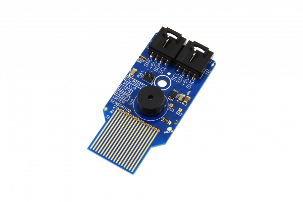

[](https://store.ncd.io/product/water-detection-sensor-with-buzzer/).

# PCA9536_WDBZ

This Water Sensor is designed to detect water or liquid leakage.  Convenient I2C interface makes it easy to add water leakage detection to any IoT application in seconds.  Integrated on-board Buzzer can be used for alarm notification applications. This Water detect Sensor uses a PCA9536 digital IO to detect the water and to control the buzzer.
This Device is available from www.ncd.io

[SKU: PCA9536_WDBZ]

(https://store.ncd.io/product/water-detection-sensor-with-buzzer/)
This Sample code can be used with Raspberry Pi.

Hardware needed to interface PCA9536_WDBZ sensor With Raspberry Pi :

1. <a href="https://store.ncd.io/product/water-detection-sensor-with-buzzer/">PCA9536 Water Detection Sensor With Buzzer</a>

2.  <a href="https://store.ncd.io/product/i2c-shield-for-raspberry-pi-3-pi2-with-outward-facing-i2c-port-terminates-over-hdmi-port/">Raspberry Pi I2C Shield</a>

3. <a href="https://store.ncd.io/product/i%C2%B2c-cable/">I2C Cable</a>

## Python

Download and install smbus library on Raspberry pi. Steps to install smbus are provided at:

https://pypi.python.org/pypi/smbus-cffi/0.5.1

Download (or git pull) the code in pi. Run the program.

```cpp
$> python PCA9536_WDBZ.py
```
The lib is a sample library, you will need to calibrate the sensor according to your application requirement.
